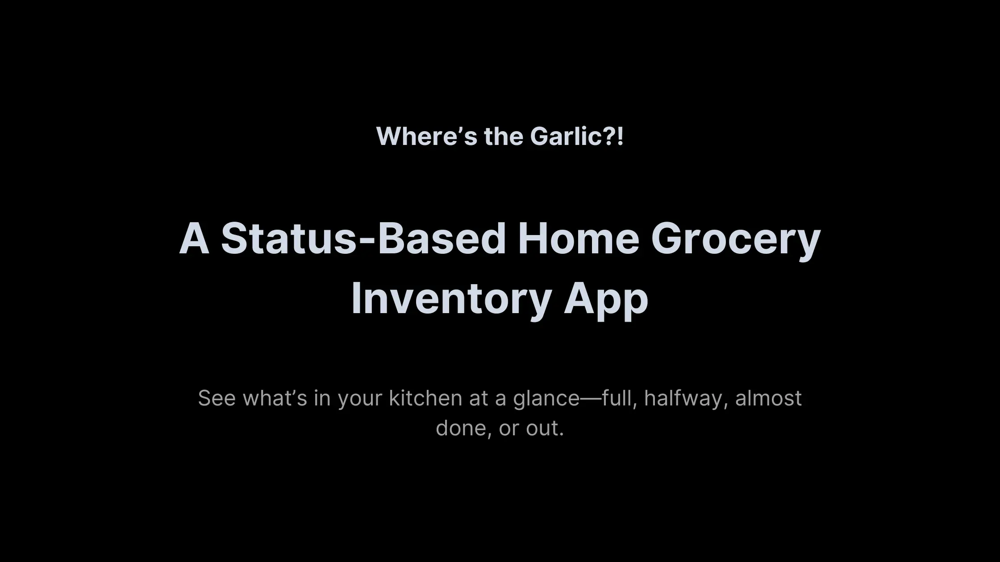
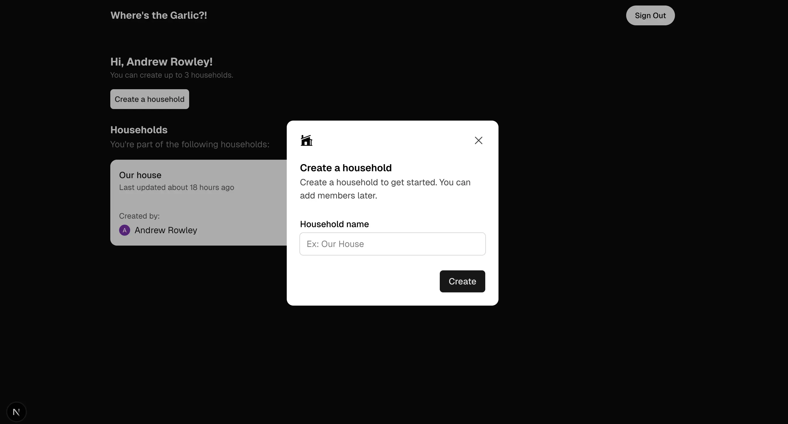
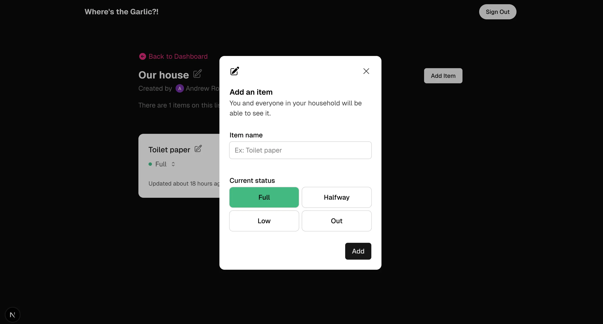
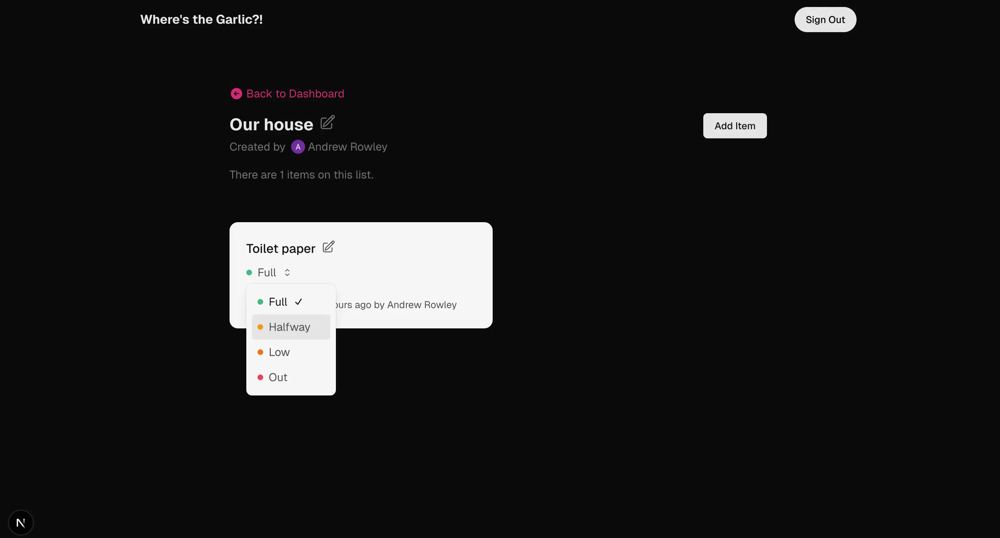

<strong>Where's the Garlic?!</strong>

A Status-Based Home Grocery Inventory App See what's in your kitchen at a glance—full, halfway, almost done, or out.

 

<a href="https://www.wheresthegarlic.com/">Visit Where's the Garlic?!</a>

 

# Introduction

_Where's the Garlic?!_ is a status-based home grocery inventory app that helps you track what's in your kitchen at a glance. Easily know what's full, halfway, almost done, or out.

## Why

Picture this: You're halfway through cooking dinner when you hear the familiar sound of fridge-diving from the kitchen. The milk gets moved. Three different pickle jars are pushed aside. Your partner is now practically inside the refrigerator when the inevitable cry of exasperation rings out:

"WHERE'S THE GARLIC?!"

(Spoiler: I used the last of it two days ago and, naturally, forgot to mention it.)

While there are plenty of inventory apps out there, they're often loaded with features we don't need—barcode scanners, meal planners, and enough metrics to manage a small grocery store.

I don't need all of that. I just wanted a simple way to stop being the villain in the "I thought we had that" story.

This app does one thing: it lets everyone in your household know if something is:

- 🟢 Full ("We're stocked!")
- 🟡 Halfway ("Still good!")
- 🟠 Almost Done ("Buy it soon!")
- 🔴 Out ("Don't make me sleep on the couch!")

Sometimes the best way to say "I love you" is making sure your partner knows the garlic is gone before they're elbow-deep in dinner prep.

## Built With

- [Next.js](https://nextjs.org/) - React framework
- [Supabase](https://supabase.com/) - Backend and Authentication
- [TypeScript](https://www.typescriptlang.org/) - Type safety
- [Tailwind CSS](https://tailwindcss.com/) - Styling

## Features

- 📊 Simple status tracking: Full, Halfway, Almost Done, or Out
- 🏠 Household management for shared inventories
- 🔍 Quick-glance interface without unnecessary complexity
- 📱 Mobile-friendly design for checking inventory on the go
- 🔐 Secure Google authentication

## Screenshots

## Roadmap

- Push for V1 to allow users to use the base version of the app [#7](https://github.com/internetdrew/wtg-app/pull/7)
- Update metadata for SEO purposes [#9](https://github.com/internetdrew/wtg-app/pull/9)
- Allow users to delete households [#15](https://github.com/internetdrew/wheres-the-garlic/pull/15)
- Allow users to be able to search items [#16](https://github.com/internetdrew/wheres-the-garlic/pull/16), [#17](https://github.com/internetdrew/wheres-the-garlic/pull/17)
- Add sorting by status and quantity [#19](https://github.com/internetdrew/wheres-the-garlic/pull/19)
- Add input validation and rate limiting
- Add integration tests
- Implement progressive-web app functionality
- Add real-time updates
- Add initial shopping mode (run feedback loop)
- Add feedback layer for power users
- Add alerts to warn of duplicate entries
